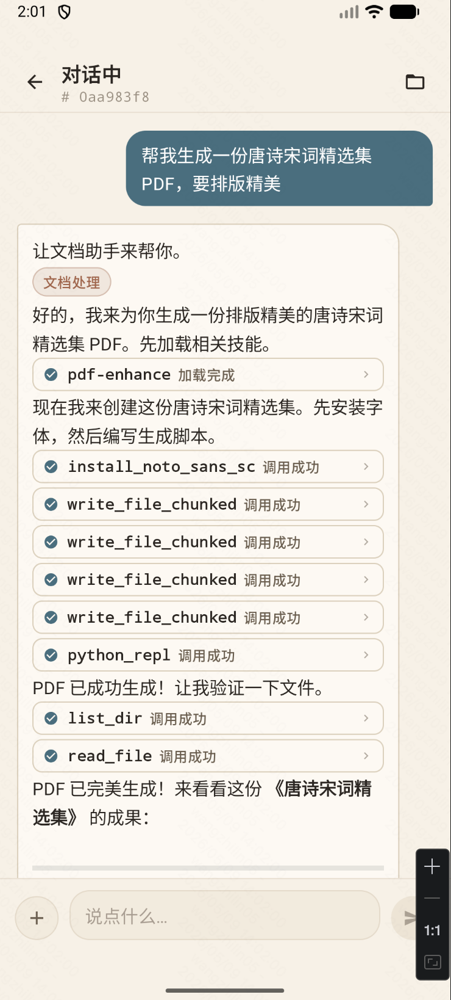
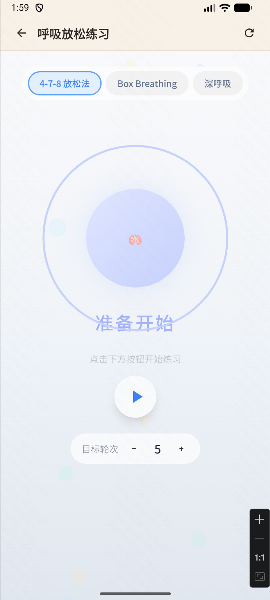
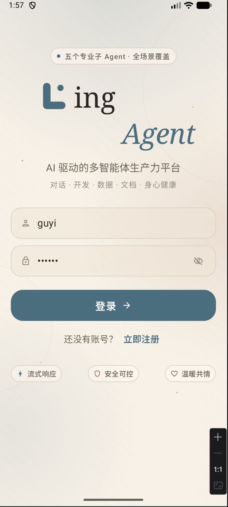
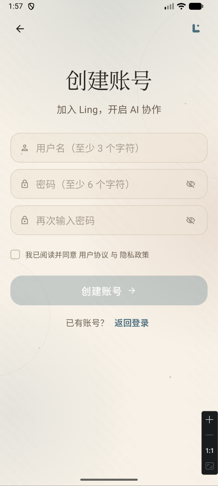
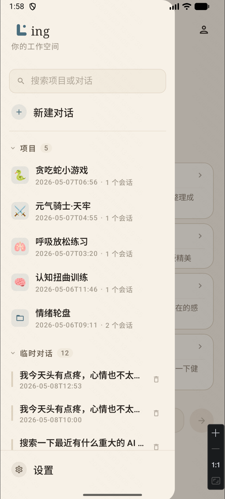
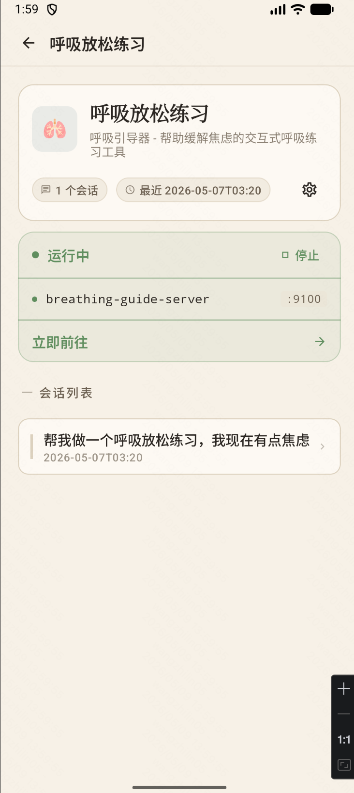
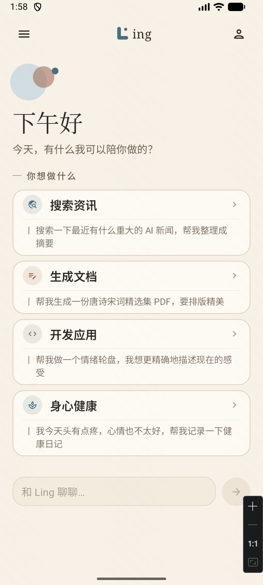
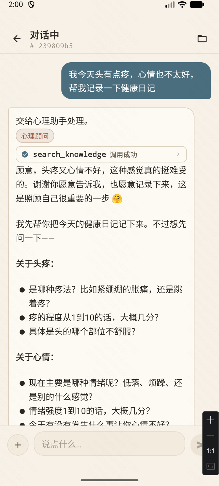
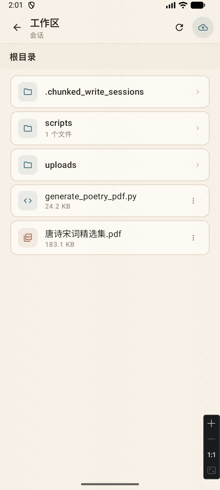

# Ling Agent - Android Client

<div align="center">

智能 AI 对话助手 Android 应用

[](https://kotlinlang.org)
[](https://developer.android.com/jetpack/compose)
[](https://m3.material.io/)
[]()

</div>

---

## 项目介绍

Ling-App 是 [Ling-Agent](https://github.com/guyi-a/Ling-Agent) AI 助手的 Android 原生客户端，基于 Jetpack Compose 构建，搭配自研 Warm Calm 设计系统，提供「项目化对话 + 工作区沙箱 + 应用即生成」的完整移动端体验。

### 主要特性

- **项目化对话** - 项目（Project）与临时对话（Adhoc）两种形态，侧边抽屉一键切换
- **流式对话** - SSE 实时流式输出，逐 token 显示 AI 回复，支持中途停止
- **Skill / 工具调用** - 可视化展示 Agent 调用工具（知识检索、健康档案、量表测评、Python 执行等）
- **Dev 进程管理** - 项目详情页查看正在运行的应用，启动 / 停止 / 重启 / 一键预览
- **WebView 预览** - App 内直接打开 Agent 生成的 Web 应用
- **Markdown 渲染** - AI 消息支持代码块、列表、表格等格式
- **消息操作** - 长按消息可复制、删除、重新生成、编辑
- **工作区** - 文件树形浏览、上传 / 下载 / 预览，工具审批
- **个人资料** - 头像上传、用户名编辑、账号安全
- **完整设置** - 主题配色、字体大小、深色模式、修改密码
- **Warm Calm 设计系统** - 自研 Logo、按钮、输入框、AmbientBackdrop 氛围背景与渐入动画

---

## 技术栈

| 类别 | 技术 |
|------|------|
| 语言 | Kotlin 2.2.10 |
| UI | Jetpack Compose + Material 3 |
| 网络 | Retrofit + kotlinx.serialization + OkHttp |
| 流式 | OkHttp EventSource (SSE) |
| 图片 | Coil (AsyncImage) |
| 本地存储 | DataStore Preferences |
| Markdown | compose-markdown (jeziellago) |
| 导航 | Navigation Compose |
| WebView | androidx.webkit |

---

## 快速开始

### 环境要求

- JDK 11+
- Android Studio Hedgehog (2023.1.1) 或更高版本
- Android SDK 36
- Ling-Agent 后端服务运行中（端口 9000）

### 构建运行

```bash
git clone https://github.com/guyi-a/Ling-App.git
cd Ling-App
./gradlew installDebug
```

或在 Android Studio 中打开项目并运行。

### 后端连接

- 模拟器自动连接 `http://10.0.2.2:9000`
- 真机需修改 `RetrofitClient.kt` 中的 `BASE_URL` 为局域网 IP

---

## 功能截图

<div align="center">

| 登录 Hero | 欢迎页 | 项目运行中 |
|---|---|---|
|  |  |  |

| 心理咨询对话 | 文档生成 | WebView 预览 |
|---|---|---|
|  |  |  |

| 侧边抽屉 | 工作区 | 注册 |
|---|---|---|
|  |  |  |

</div>

---

## 项目结构

```
app/src/main/java/com/guyi/demo1/
├── MainActivity.kt                  # 入口：主题应用 + 启动导航
├── LingAgentApplication.kt          # Application：DI 容器初始化
├── data/
│   ├── api/                         # Retrofit API：Auth/Chat/Project/Dev/Workspace
│   ├── local/                       # DataStore（Token、主题、字体）
│   ├── model/                       # 数据模型：Project/DevProcess/Message/SSEEvent...
│   ├── network/                     # Retrofit/OkHttp/SSE/AuthInterceptor
│   ├── repository/                  # 仓库层
│   └── AppContainer.kt              # 依赖注入容器
├── ui/
│   ├── screen/
│   │   ├── auth/                    # 登录、注册
│   │   ├── home/                    # 欢迎页
│   │   ├── chat/                    # 聊天 + 工具调用展示
│   │   ├── project/                 # 项目详情（含 Dev 进程管理）
│   │   ├── webview/                 # 应用预览 WebView
│   │   ├── workspace/               # 文件树形浏览
│   │   ├── profile/                 # 个人资料、账号安全、修改密码
│   │   └── settings/                # 主题、字体、深色模式、关于
│   ├── components/                  # 通用组件 + Ling 设计系统
│   │   ├── LingButton / LingTextField / LingLogo
│   │   ├── AmbientBackdrop / FadeInRise
│   │   ├── NavigationDrawer / ChatInputBar
│   │   └── AttachmentCard / ToolApprovalDialog ...
│   ├── navigation/                  # NavGraph 路由
│   └── theme/                       # Color / Type / Shape / Spacing
└── res/                             # 资源：图标、ic_ling_logo
```

---

## 后端 API

完整对接 Ling-Agent 后端：

- **认证** - 登录 / 注册 / 修改密码 / 自动 Token 刷新
- **用户** - 信息获取 / 资料更新 / 头像上传
- **项目** - 创建 / 列表 / 详情 / 重命名 / 删除 / Adhoc 临时会话
- **会话** - 创建 / 列表 / 删除
- **聊天** - SSE 流式对话 / 停止生成 / 工具审批 / Skill 加载事件
- **消息** - 历史记录 / 删除 / 编辑后批量删除
- **工作区** - 树形列表 / 上传 / 下载 / 预览 / 删除
- **Dev 进程** - 列出 / 停止 / 重启 / 跨会话聚合视图

详见后端 API 文档：`http://localhost:9000/docs`

---

## 许可证

MIT License

---

## 相关链接

- [Ling-Agent 后端](https://github.com/guyi-a/Ling-Agent)
- [Jetpack Compose](https://developer.android.com/jetpack/compose)
- [Material Design 3](https://m3.material.io/)

---

<div align="center">

Made with Jetpack Compose

</div>
